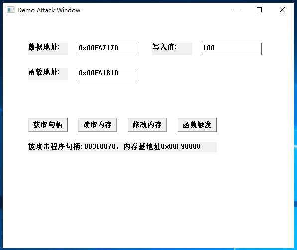

本文介绍如何攻击程序一个应用进程，包括修改内存数据，事件拦截。  
CE官网地址：[https://www.cheatengine.org](https://www.cheatengine.org)  
OD官网地址：[https://www.ollydbg.de](https://www.ollydbg.de)  
被攻击程序源码：[https://github.com/zz-c/CMAKE/tree/main/windows_test](https://github.com/zz-c/CMAKE/tree/main/windows_test)  
攻击程序源码：[https://github.com/zz-c/CMAKE/tree/main/windows_attack_test](https://github.com/zz-c/CMAKE/tree/main/windows_attack_test)  

## CE使用

找出和修改程序数据的内存地址。  


## OD使用

修改程序数据的内存地址。  
拦截CALL事件。  
  
Ctrl+G 搜索需要查找的内存地址。  
选择数值->右键点击->Binary->Edit。进行内存地址数值修改。  
Alt+F1调出Command line。  
输入 "hw ${内存地址}" 设置硬件断点，内存被修改时触发。  
找到触发修改内存call的地址。  

## 攻击程序使用



## 源码windows api说明

### 获取窗口句柄

```C
HWND FindWindow(
  LPCTSTR lpClassName,  //窗口类名 NULL
  LPCTSTR lpWindowName  //窗口标题
);
```

```C
// 回调函数，枚举窗口时调用
BOOL CALLBACK EnumWindowsProc(HWND hwnd, LPARAM lParam) {
    char windowTitle[256];
    // 获取窗口标题
    if (GetWindowText(hwnd, windowTitle, sizeof(windowTitle))) {
        // 检查标题是否包含“记事本”
        if (strstr(windowTitle, "Demo Window") != NULL) {
            printf("句柄: %p, 标题: %s\n", hwnd, windowTitle);
            // 找到目标窗口，保存句柄并停止枚举
            HWND* pHwnd = (HWND*)lParam;
            *pHwnd = hwnd;
            return FALSE; // 停止枚举
        }
    }
    return TRUE; // 继续枚举
}

HWND hwnd = NULL;
EnumWindows(EnumWindowsProc, (LPARAM)&hwnd);
```

### 获取窗口进程ID

```C
DWORD GetWindowThreadProcessId(
  HWND hWnd,             // handle to window
  LPDWORD lpdwProcessId  // 指向变量的指针 用来返回进程PID
);
```

### 打开指定进程

```C
HANDLE OpenProcess(
  DWORD dwDesiredAccess,  // 访问权限 标记
  BOOL bInheritHandle,    // false;
  DWORD dwProcessId       // lpdwProcessId  进程ID标识
);
```

### 读指定进程内存数据

```C
BOOL ReadProcessMemory(
  HANDLE hProcess,  //  HANDLE OpenProcess返回值
  LPCVOID lpBaseAddress, // 读取 进程起始地址 基址
  LPVOID lpBuffer,  // 存放数据的缓冲区
  DWORD nSize,      // 要读出的字节数
  LPDWORD lpNumberOfBytesRead // 实际读出字节数
);
```

### 指定进程内存写入

```C
BOOL WriteProcessMemory(
  HANDLE hProcess,      // 目标进程的句柄
  LPVOID lpBaseAddress, // 目标进程中的起始内存地址
  LPCVOID lpBuffer,     // 要写入的数据的缓冲区
  SIZE_T nSize,         // 要写入的数据的大小（字节）
  SIZE_T *lpNumberOfBytesWritten // 实际写入的字节数
);
```

### 远程CALL调用

```C
HANDLE CreateRemoteThread(
  HANDLE hProcess,              // 目标进程的句柄
  LPSECURITY_ATTRIBUTES lpThreadAttributes, // 线程的安全属性（通常为 NULL）
  SIZE_T dwStackSize,          // 线程的栈大小（0 表示使用默认栈大小）
  LPTHREAD_START_ROUTINE lpStartAddress, // 线程的启动例程（线程的入口点）
  LPVOID lpParameter,          // 传递给线程的参数
  DWORD dwCreationFlags,       // 创建标志（如 CREATE_SUSPENDED）
  LPDWORD lpThreadId           // 指向接收线程 ID 的变量的指针（可选）
);
```
