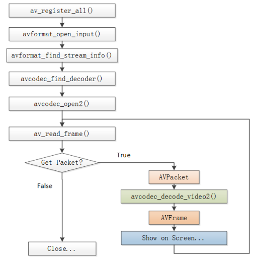
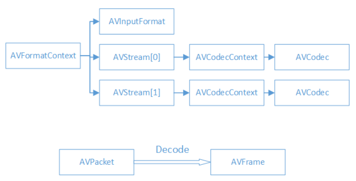
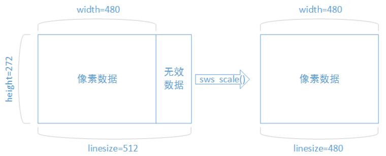

源码：[https://github.com/zz-c/ffmpeg](https://github.com/zz-c/ffmpeg)  

> FFmpeg库

* avcodec：编解码（最重要的库）。
* avformat：封装格式处理。
* avfilter：滤镜特效处理。
* avdevice：各种设备的输入输出。
* avutil：工具库（大部分库都需要这个库的支持）。
* postproc：后加工。
* swresample：音频采样数据格式转换。
* swscale：视频像素数据格式转换。

> FFmpeg解码的流程

* av_register_all()：注册所有组件。
* avformat_open_input()：打开输入视频文件。
* avformat_find_stream_info()：获取视频文件信息。
* avcodec_find_decoder()：查找解码器。
* avcodec_open2()：打开解码器。
* av_read_frame()：从输入文件读取一帧压缩数据。
* avcodec_decode_video2()：解码一帧压缩数据。
* avcodec_close()：关闭解码器。
* avformat_close_input()：关闭输入视频文件。

> FFmpeg解码的数据结构

* AVFormatContext
  封装格式上下文结构体，也是统领全局的结构体，保存了视频文件封装格式相关信息。
* AVInputFormat
  每种封装格式（例如FLV, MKV, MP4, AVI）对应一个该结构体。
* AVStream
  视频文件中每个视频（音频）流对应一个该结构体。
* AVCodecContext
  编码器上下文结构体，保存了视频（音频）编解码相关信息。
* AVCodec
  每种视频（音频）编解码器(例如H.264解码器)对应一个该结构体。
* AVPacket
  存储一帧压缩编码数据。
* AVFrame
  存储一帧解码后像素（采样）数据。

> FFmpeg数据结构分析

* AVFormatContext  
  iformat：输入视频的AVInputFormat  
  nb_streams ：输入视频的AVStream 个数  
  streams ：输入视频的AVStream []数组  
  duration ：输入视频的时长（以微秒为单位）  
  bit_rate ：输入视频的码率  
* AVInputFormat  
  name：封装格式名称  
  long_name：封装格式的长名称  
  extensions：封装格式的扩展名  
  id：封装格式ID  
  一些封装格式处理的接口函数  
* AVStream  
  id：序号  
  codec：该流对应的AVCodecContext  
  time_base：该流的时基  
  r_frame_rate：该流的帧率  
* AVCodecContext  
  codec：编解码器的AVCodec  
  width, height：图像的宽高（只针对视频）  
  pix_fmt：像素格式（只针对视频）  
  sample_rate：采样率（只针对音频）  
  channels：声道数（只针对音频）  
  sample_fmt：采样格式（只针对音频）  
* AVCodec  
  name：编解码器名称  
  long_name：编解码器长名称  
  type：编解码器类型  
  id：编解码器ID  
  一些编解码的接口函数  
* AVPacket  
  pts：显示时间戳  
  dts ：解码时间戳  
  data ：压缩编码数据  
  size ：压缩编码数据大小  
  stream_index ：所属的AVStream  
* AVFrame  
  data：解码后的图像像素数据（音频采样数据）。  
  linesize：对视频来说是图像中一行像素的大小；对音频来说是整个音频帧的大小。  
  width, height：图像的宽高（只针对视频）。  
  key_frame：是否为关键帧（只针对视频） 。  
  pict_type：帧类型（只针对视频） 。例如I，P，B。  

  > tip

* 解码后的数据为什么要经过sws_scale()函数处理？  
  解码后YUV格式的视频像素数据保存在AVFrame的data[0]、data[1]、data[2]中。但是这些像素值并不是连续存储的，每行有效像素之后存储了一些无效像素 。 以亮度 Y 数据为例 ， data[0] 中一共包含了linesize[0]*height个数据。但是出于优化等方面的考虑，linesize[0]实际上并不等于宽度width，而是一个比宽度大一些的值。因此需要使用sws_scale()进行转换。转换后去除了无效数据，width和linesize[0]取值相等。
  
