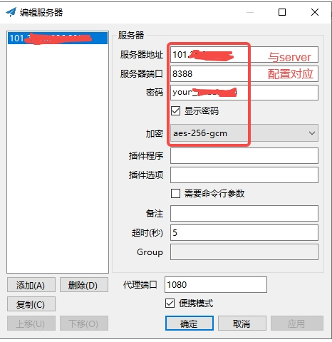

# shadowsocks
通过shadowsocks可以实现网络代理  
[Server官网：https://github.com/shadowsocks/shadowsocks-rust](<https://github.com/shadowsocks/shadowsocks-rust>)  
[Client官网：https://github.com/shadowsocks/shadowsocks-windows](<https://github.com/shadowsocks/shadowsocks-windows>)  

## Server部署
配置文件config.json
```json
{
    "server": "0.0.0.0",
    "server_port": 8388,
    "password": "your_password",
    "method": "aes-256-gcm",
    "timeout": 300
}
```
docker启动
```bash
docker run --name ssserver-rust \
  --restart always \
  -p 8388:8388/tcp \
  -p 8388:8388/udp \
  -v /path/to/config.json:/etc/shadowsocks-rust/config.json \
  -dit ghcr.io/shadowsocks/ssserver-rust:latest
```

## Client部署
下载：https://github.com/shadowsocks/shadowsocks-windows/releases  
配置：  
