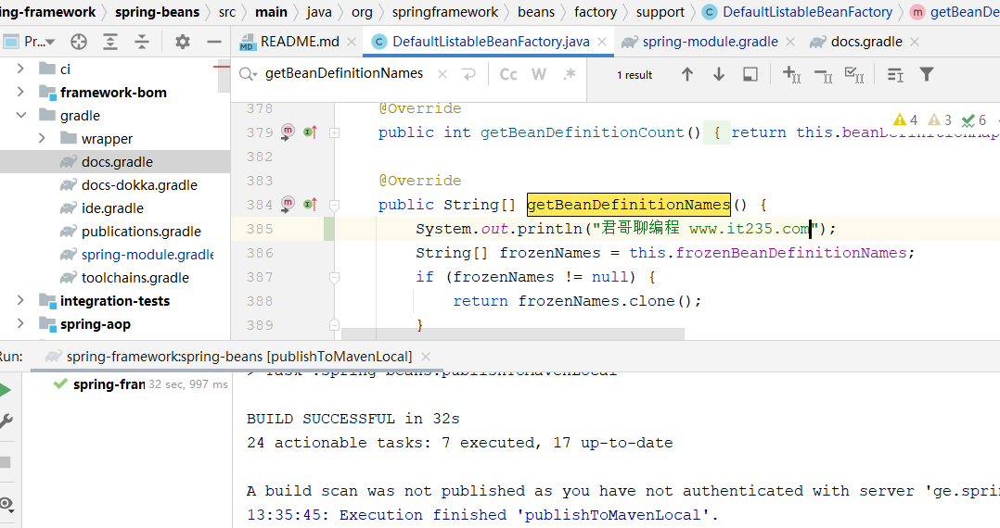
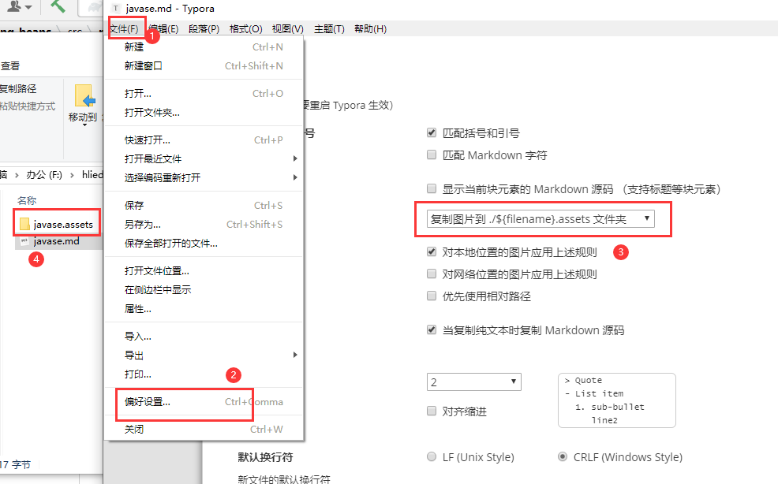

::: danger 说明

Java基础

:::

<!-- more [点击免费观看教学视频](<https://ke.qq.com/course/5285550>)

注意图片在当前文档目录下，URL使用时不可使用绝对路径

同时建议`typora`设置图片的创建方式如下：

 -->

 ## 设计模式
[示例源码：https://github.com/ZHANG-ZHENG/design-pattern](<https://github.com/ZHANG-ZHENG/design-pattern>)  
1.工厂方法模式	Factory Method Pattern  
2.抽象工厂模式	Abstract Factory Pattern  
3.建造者模式	Builder Pattern  
4.原型模式	Prototype Pattern  
5.单例模式	Singleton Pattern  
6.适配器模式	Adapter Pattern  
7.桥梁模式/桥接模式	Bridge Pattern  
8.组合模式	Composite Pattern  
9.装饰模式	Decorator Pattern  
10.门面模式/外观模式	Facade Pattern  
11.享元模式	Flyweight Pattern  
12.代理模式	Proxy pattern  
13.责任链模式	Chain of Responsibility Pattern  
14.命令模式	Command Pattern  
15.解释器模式	Interpreter Pattern  
16.迭代器模式	Iterator Pattern  
17.中介者模式	Mediator Pattern  
18.备忘录模式	Memento Pattern  
19.观察者模式	Observer Pattern  
20.状态模式	State Pattern  
21.策略模式	Strategy Pattern  
22.模板方法模式	Template Method Pattern  
23.访问者模式	Visitor Pattern  