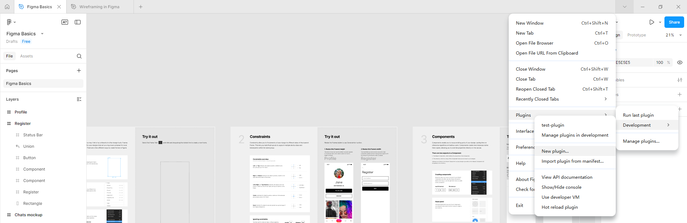
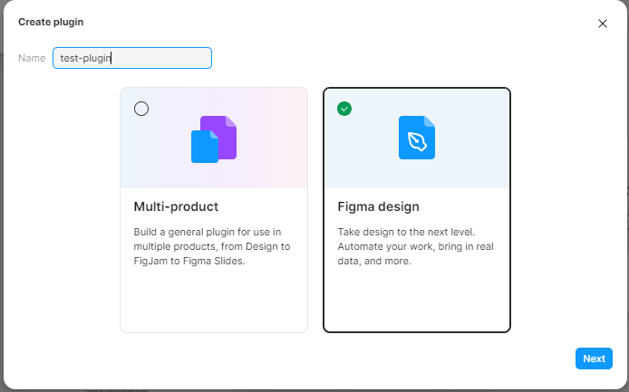
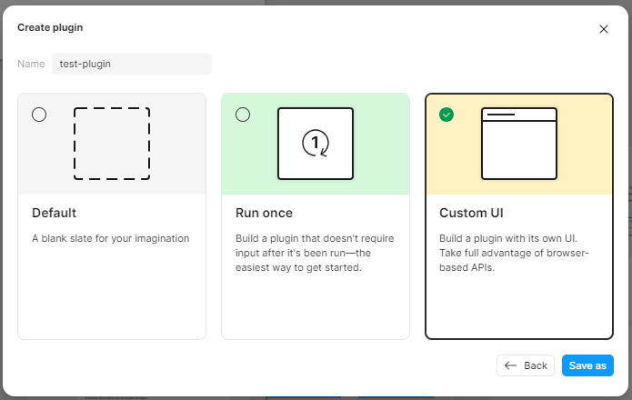
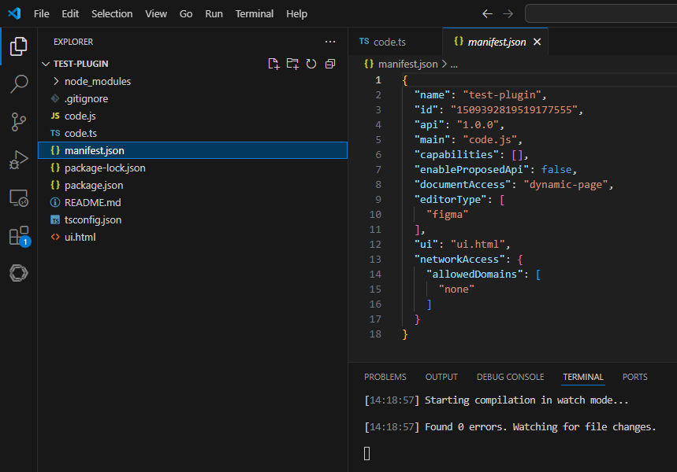
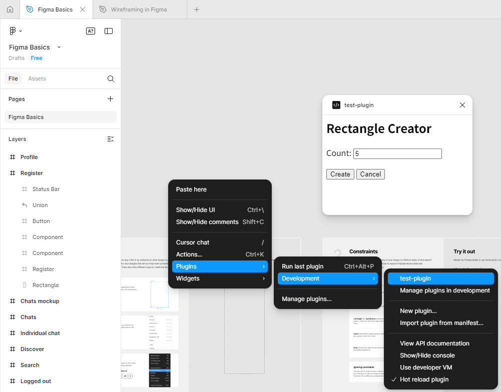

demo源码地址 https://github.com/zz-html/vue3-ts-project/tree/main/vue-ts-demo
## figma插件制作

下载和安装figma客户端：[https://www.figma.com/downloads/](<https://www.figma.com/downloads/>)  

打开 figma 客户端，新建设计文件，然后点击顶部栏的 Plugins -> Development -> New Plugin
  

然后选择 Figma design，输入插件名字，点击确定  
  

选择Custom UI，Save as导出生成的项目工程代码
  

将代码保存到本地后，安装和运行工程
```
npm install -g typescript
npm install --save-dev @figma/plugin-typings
npm run watch
```
  

在 figma 客户端运行新插件
  