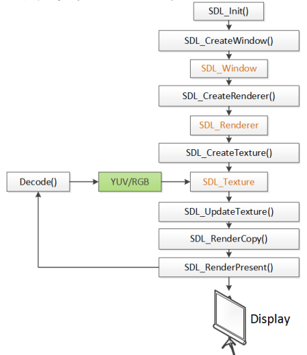

# SDL

> SDL视频显示的流程

* SDL_Init()：初始化SDL系统
* SDL_CreateWindow()：创建窗口SDL_Window
* SDL_CreateRenderer()：创建渲染器SDL_Renderer
* SDL_CreateTexture()：创建纹理SDL_Texture
* SDL_UpdateTexture()：设置纹理的数据
* SDL_RenderCopy()：将纹理的数据拷贝给渲染器
* SDL_RenderPresent()：显示
* SDL_Delay()：工具函数，用于延时。
* SDL_Quit()：退出SDL系统

> SDL视频显示的数据结构

* SDL_Window 代表了一个“窗口”
* SDL_Renderer 代表了一个“渲染器”
* SDL_Texture 代表了一个“纹理”
* SDL_Rect 一个简单的矩形结构

> SDL中事件和多线程

* SDL多线程
函数
SDL_CreateThread()：创建一个线程
数据结构
SDL_Thread：线程的句柄

* SDL事件
函数
SDL_WaitEvent()等待一个事件
SDL_PushEvent()发送一个事件
数据结构
SDL_Event：代表一个事件
