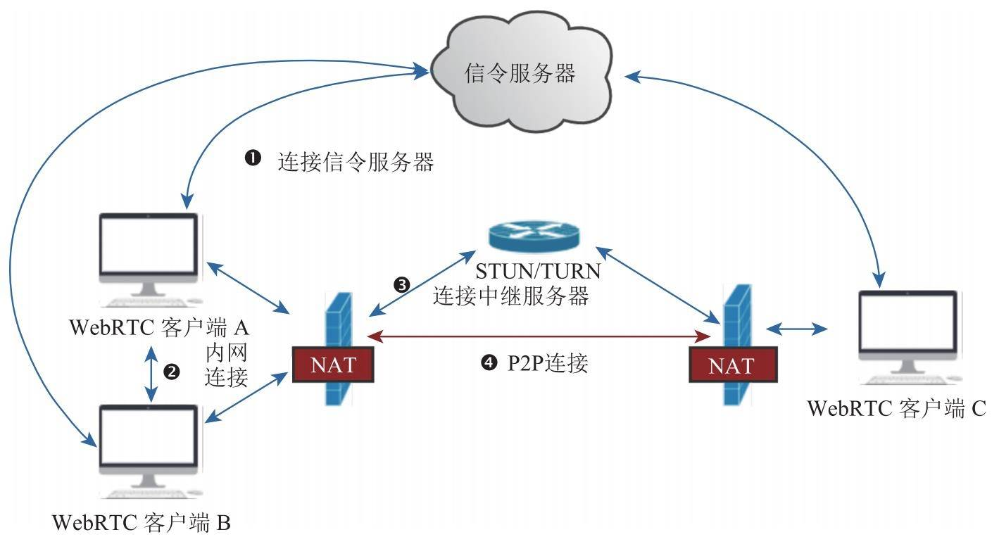
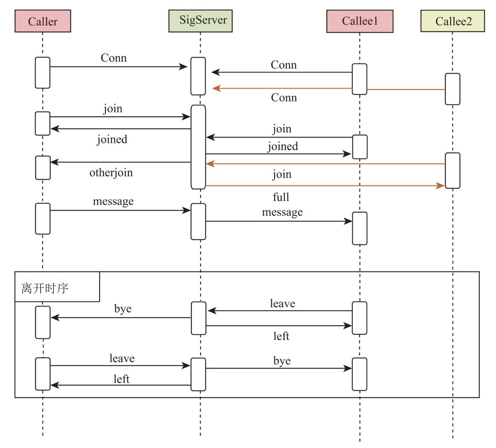
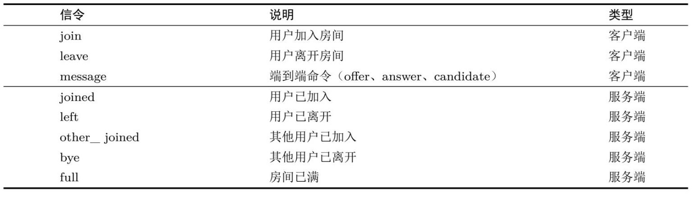
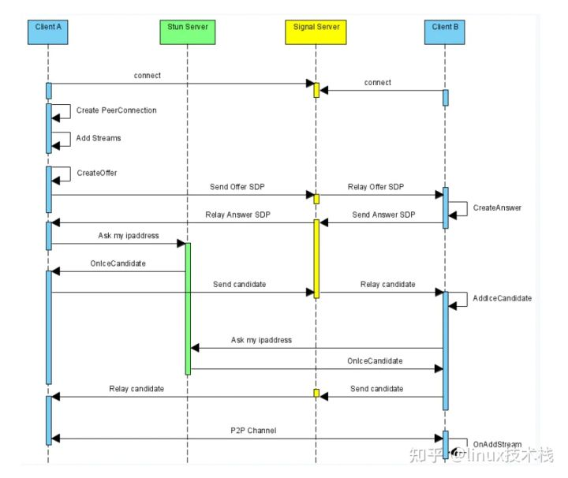

# Webrtc
WebRTC是一个由Google发起的实时通讯解决方案，其中包含视频音频采集，编解码，数据传输，音视频展示等功能，我们可以通过技术快速地构建出一个音视频通讯应用。虽然其名为WebRTC，但是实际上它不光支持Web之间的音视频通讯，还支持Android以及IOS端，此外由于该项目是开源的，我们也可以通过编译C++代码，从而达到全平台的互通。
## 源码地址
[DEMO](https://github.com/zz-media/webrtc)
## 交互流程
### ice整体流程

### 信令流程
  
  
### 连接建立流程:
  