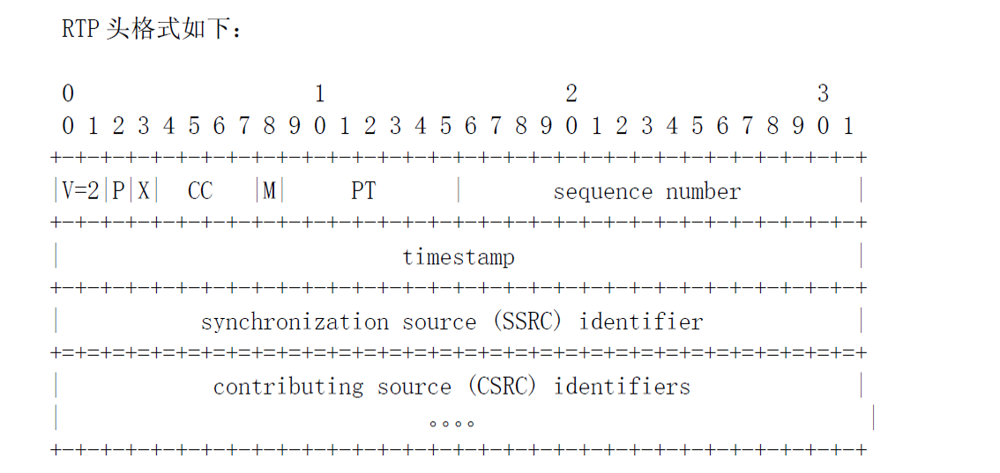
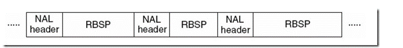
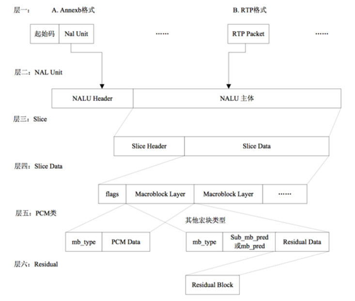

> RTP包的结构

M标识位:Mark标识位，用于标识一段视频序列包是否结束。因为视频的数据量大，视频序列可能会包括在多个RTP包中。需要标识位指示序列也结束。

PT: Payload type 标识RTP携带的媒体数据的类型。通过该字段可以知道RTP包携带的是什么类型的编码格式。

Sequence number:序列号，用于标识RTP包的顺序。我们知道对视频来说是有严格是时序的，那么在网络上传输的数据包必须有能标识顺序的字段，该字段是加1递增的。

Timestamp:标准中规定的是对应于每个RTP包携带的视/音频的采样时间，注意并不是指定的时钟时间，这里的采样时间通过音频或视频的一个采用周期来换算的，换算公式: ts_current_90000hz = (当前系统时间ms - start_time_ms) * 90000.0 / 1000.0。这个字段值有比较多的灵活性，常见的生成值方案有:根据实际的采样时间，按照固定的音视频采样周期递增，比如以40ms的周期递增，那么每个RTP的时间戳间隔就9000*40ms = 3600。

SSRC:一条RTP流的唯一标识，有多条RTP流，那么每条 RTP流的SSRC是不能相同的。

> NALU的结构

NAL头 +RBSP(视频编码数据)

NALU头结构长度1byte：Forbidden_bit(1bit) + nal_reference_bit(2bit)+Nal_unit_type(5bit)

forbidden_bit:禁止位，初始为0，当网络发现NAL单元有比特错误时可设置该比特为1，以便接收方纠错或丢掉该单元。

nal_reference_bit: NAL重要性指示，标志该NAL单元的重要性，值越大，越重要，解码器在解码处理不过来的时候，可以丢掉重要性为0的NALU

nal_unit_type: 指示NALU的类型，需要关注的类型: 5 IDR，6 视频序列解码的增强信心(SEI) 7 序列参数集(SPS)，8 图像参数集(PPS)

>携带H264的RTP的包结构

