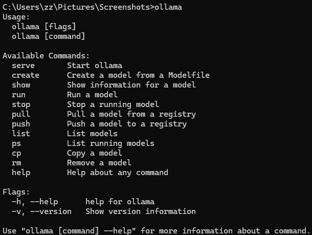
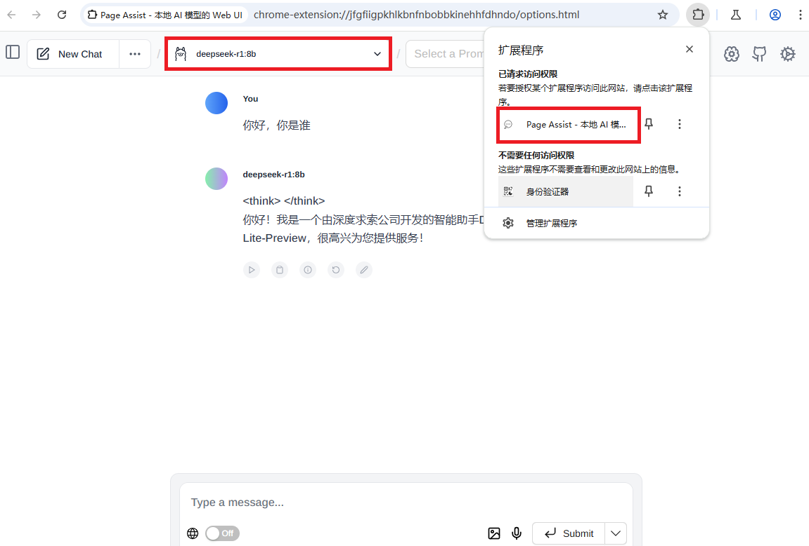
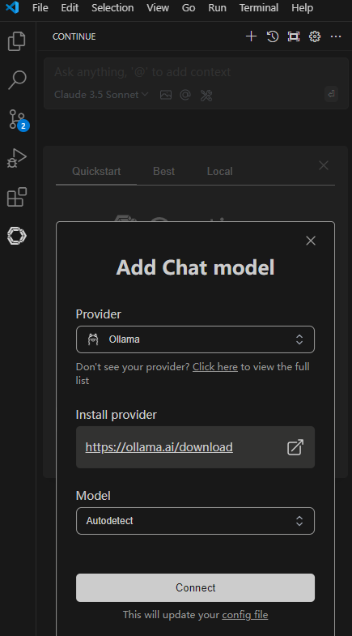
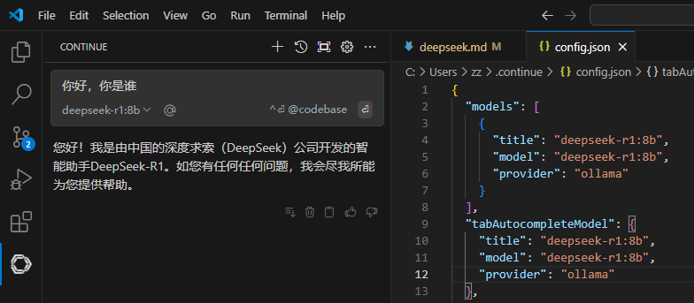

## 本地运行deepseek模型

需要准备N卡电脑。  

## ollama安装  
ollama是AI模型部署平台  
[ollama官网：https://ollama.com](<https://ollama.com>)  
[ollama github：https://github.com/ollama/ollama](<https://github.com/ollama/ollama>)  
下载Windows版本，直接安装，打开cmd，输入ollama验证是否安装好。  


## deepseek模型

镜像和显卡对应关系：1.5b 模型，4GB显存。7b、8b 模型，8GB显存。14b 模型，12GB显存。32b 模型，24GB显存。  
拉取deepseek模型并运行。  
```bash
ollama list 
ollama pull deepseek-r1:8b
ollama run deepseek-r1:8b
# 停止运行
ollama stop deepseek-r1:8b
```
> 外部访问需要配置环境变量 OLLAMA_HOST=0.0.0.0 OLLAMA_ORIGINS=*

## Page Assist访问模型

谷歌浏览器扩展程序安装Page Assist。  
可以使用浏览器窗口访问deepseek模型。  


## VS Code访问模型

搜索并安装Continue插件。  
点击Continue插件图标，选择“Add Chat model”。  
Provider选择“Ollama”。  
Install provider默认不变。  
Model选择“DeepSeek Coder”。  
完成配置点击“Connect”。  
  
"config file"修改config.json配置对应模型。  
```json
  "models": [
    {
      //"apiBase": "http://x.x.x.x:11343",//访问其他设备ollama
      "title": "deepseek-r1:8b",
      "model": "deepseek-r1:8b",
      "provider": "ollama"
    }
  ],
  "tabAutocompleteModel": {
    //"apiBase": "http://x.x.x.x:11343",//访问其他设备ollama
    "title": "deepseek-r1:8b",
    "model": "deepseek-r1:8b",
    "provider": "ollama"
  }
``` 
开始使用。
   

