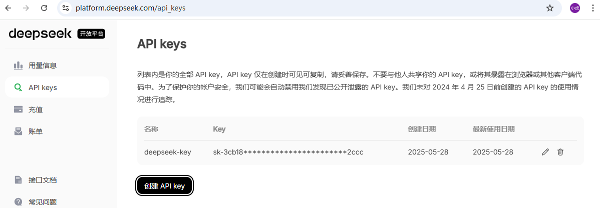

API 文档：[https://platform.openai.com/docs/api-reference](<https://platform.openai.com/docs/api-reference>)

ChatCompletion 文档：[https://platform.openai.com/docs/guides/chat](<https://platform.openai.com/docs/guides/chat>)

## 准备一个API Key

登录deepseek开放平台，创建一个API key，并在账号下充值
  

## API调用  

安装openai包
```bash
pip install openai
```

python代码

```python
from openai import OpenAI
client = OpenAI(api_key="sk-3cb18***********************2ccc", base_url="https://api.deepseek.com")
response = client.chat.completions.create(
    model="deepseek-chat",
    messages=[
        {"role": "system", "content": "你是编码助手"},
        {"role": "user", "content": "你是谁"},
    ],
    stream=False
)
print(response.choices[0].message.content)
```

流式响应：
```python
from openai import OpenAI
client = OpenAI(api_key="sk-3cb18***********************2ccc", base_url="https://api.deepseek.com")
# 流式响应
response = client.chat.completions.create(
    model="deepseek-chat",
    messages=[
        {"role": "system", "content": "你是编码助手"},
        {"role": "user", "content": "你是谁"},
    ],
    stream=True
)
for chunk in response:
    if chunk.choices[0].delta.content is not None:
        print(chunk.choices[0].delta.content, end="")
```